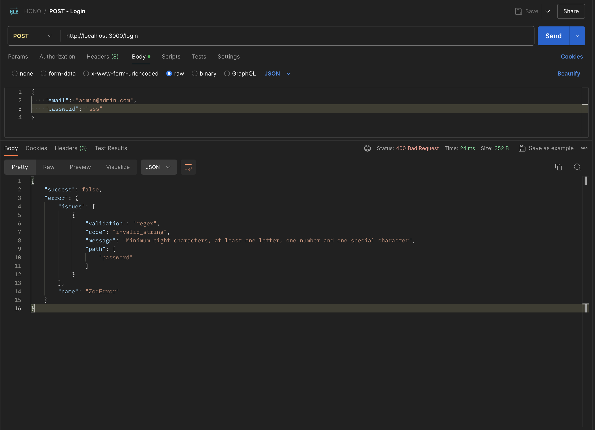
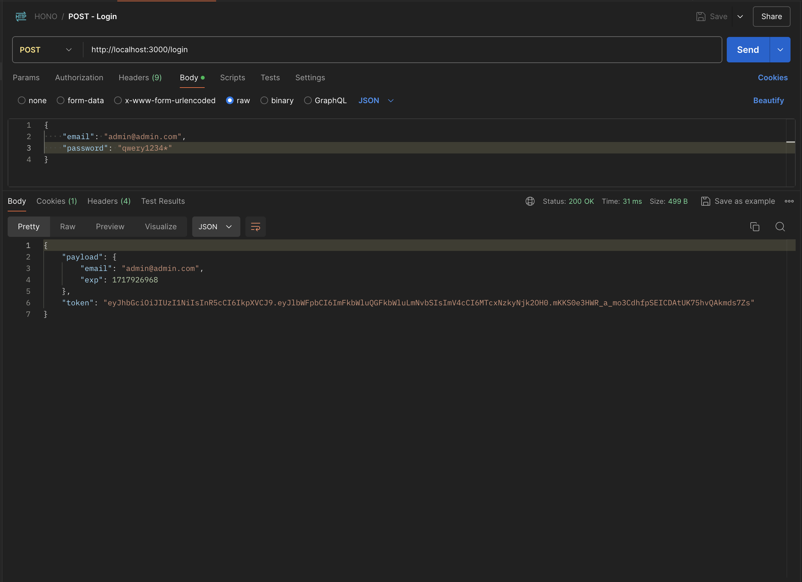
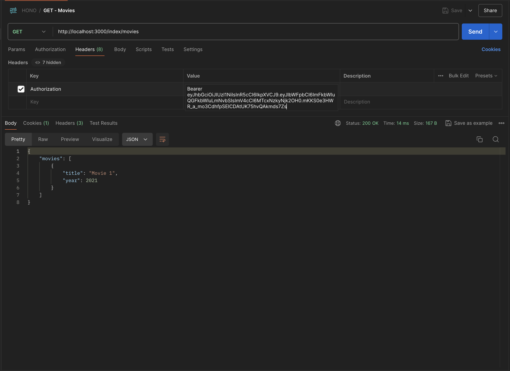

# My Bun

## Description

Create User Authentication using `hono` & `bun`

To install dependencies:

```sh
bun install
```

To run:

```sh
bun run dev
```

open <http://localhost:3000>

## Captured

### Login ( Failed )



### Login ( Success )



### Index



